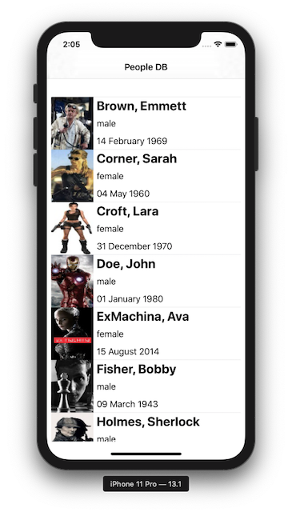
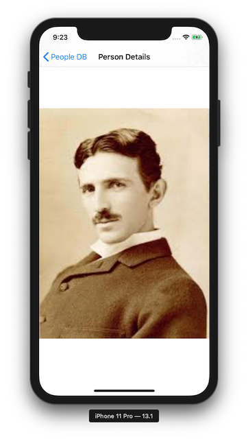

# ME Android Code Challenge

## Introduction & Requirements

The goal of this code challenge is to allow us to evaluate your software development and problem solving skills.

We are looking for pragmatic, maintainable, easy to read, as well as testable code.
In particular, we would like to see you demonstrate the utilisation of technologies mentioned below.
We encourage you to use 3rd party libraries as you see fit to support the design of your solution. 
When there are multiple choices of solution or uses of 3rd-party packages, please chose one.

Please deliver a solution that meets requirements below.

-   Demonstrate knowlege in Kotlin and Java programming language
-   Demonstrate knowlege in development tools and processes, for example

    -   Android Studio
    -   Write an app, build & run processes, debug, profile, test, and publish
    -   Visual layout editor
    -   Build app from CLI

-   Demonstrate integration ability with re-usable components, for example:

    -   Test Frameworks: Cucumber, Espresso, Mockito, etc
    -   Communication Frameworks: Retrofit (http/REST)
    -   JSON and data formatting: Android GSON
    -   Logging frameworks: Timber, Hugo, Frodo, etc
    -   etc

-   Test Driven Development (TDD) or Behaviour Drive Development (BDD). a successful applicant will be asked to demonstrate a running BDD tests and show test coverage and results

    - Demonstrate knowledge in BDD and Gherkin language
    - Demonstrate writing tests with feature, scenarios, and steps with Given/When/Then
    - Demonstrate uses of shared fixtures

-   Code documentation

-   Interface with Rest API

    - Demonstrate the understanding of RAML or Open API specification


## Time & Effort

There is no time limit for this code challenge. However, this code challenge should require not more than 3 - 4 hours of your time to complete.

## The Problem

You are required to implement an Android application that interfaces to REST api server to display employees details.
The essence of this test is to see that your code can serialise and de-serialise images as JSON data.

### Example Data

#### Employees List

```
[
    {
        "id": 1,
        "first_name": "John",
        "last_name": "Doe",
        "gender": "male",
        "birth_date": "01 January 1980",
        "thumbImage": "\"/9j/4AAQSkZJRgABAQAAAQABAAD/2wBDAAIBAQEBAQIBAQECAgICAgQDAgICAgUEBAMEBgUGBgYFBgYGBwkIBgcJBwYGCAsICQoKCgoKBggLDAsKDAkKCgr/2wBDAQICAgICAgUDAwUKBwYHCgoKCgoKCgoKCgoKCgoKCgoKCgoKCgoKCgoKCgoKCgoKCgoKCgoKCgoKCgoKCgoKCgr/...""
    },
    {
        "id": 2,
        "first_name": "Emmett",
        "last_name": "Brown",
        "gender": "male",
        "birth_date": "14 February 1969",
        "thumbImage": "..."
    },
    ...
]
```

### Employee Details

```
{
    "id": 1,
    "first_name": "John",
    "last_name": "Doe",
    "gender": "male",
    "birth_date": "01 January 1980",
    "thumbImage": "...",
    "image": "..."
}

```

### The Application

-   Implement _native_ Android application of your choices (using Kotlin and Android Visual Studio)
-   Application should consume JSON data from a server running locally on your machine (see Employees RAML specification below)
-   Application should provide a screen that shows the list of employees (see sample screens below)
-   Application should provde a screen that shows details (i.e. includes full image) of a selected employee
-   Setup a public repository (i.e. Github repository)
-   Put your Android project on your Git public repository
-   Send us a link to your git repository

#### Employee List Screen

Note: sample screens are from iOS device. They are shown for indication only.



#### Employee Details Screen



## Installing Code Challenge

-   Clone ME Android Code Challenge Project from Github. Github repository is [here](https://github.com/ME-development/android-challenge)
-   Your project directory should contain a structure similar to below

```
├── README.md
├── clients/
|   ├── android/
│   └── ios/
├── people.raml
├── res/
│   └── images/
└── servers/
    └── people/
        ├── images/
        └── ppl_server.py
```

-   Make sure you have Python 3.5 or higher version installed

-   Install python packages using `pip` and `requirements.txt` file.

```
$ cd PROJECT_DIR
$ cd servers/people
$ pip install -r requirements.txt
```

### Running People Server

```
$ cd PROJECT_DIR
$ cd servers/people
$ python3 ppl_server.py

```

You should see output as follow:

```
* Serving Flask app "ppl_server" (lazy loading)
 * Environment: development
 * Debug mode: on
 * Running on http://0.0.0.0:5000/ (Press CTRL+C to quit)
 * Restarting with stat
 * Debugger is active!
 * Debugger PIN: 123-168-005
```

Checking server's status

```
$ curl http://127.0.0.1:5000/healthCheck
"Ok"
```

Retrieve employee's details.

```
$ curl http://127.0.0.1:5000/employees/1

{
    "id": 1,
    "first_name": "John",
    "last_name": "Doe",
    "gender": "male",
    "birth_date": "01 January 1980",
    "thumbImage": "...",
    "image": "/9j/4AAQSkZJRgABAgEAZABkAAD/4RssRXhpZgAATU0AKgAAAAgABwESAAMAAAABAAEAAAEaAAUA\nAAABAAAAYgEbAAUAAAABAAAAagEoAAMAAAABAAIAAAExAAIAAAAcAAAAcgEyAAIAAAAUAAAAjodp\nAAQAAAABAAAApAAAANAAD0JAAAAnEAAPQkAAACcQQWRvYmUgUGhvdG9zaG9wIENTMyBXaW5kb3dz
    ..."
}
```

### Employees API RAML

```
#%RAML 1.0
title: Employees API
mediaType: application/json
baseUri: http://127.0.0.1:5000
version: 1.0
types:
    Employee: |
        {
            "properties": {
                "id": {
                    "type": "number",
                    "required": true
                },
                "first_name": {
                    "type": "string",
                    "required": true
                },
                "last_name": {
                    "type": "string",
                    "required": true
                },
                "gender": {
                    "type": "string",
                    "required": true
                },
                "birth_date": {
                    "type": "string",
                    "required": true
                },
                "thumbImage": {
                    "type": "string", # Base64 (UTF-8) encoded string
                    "required": false
                },
                "image": {
                    "type": "string", # Base64 (UTF-8) encoded string
                    "required": false
                },
            }
        }

/healthCheck:
    get:
        responses:
            200:
                application/json:
                    type: object
                    properties:
                        message: string
                    example:
                        message: "Ok"

/employees:
    get:
        responses:
            200:
                body:
                    properties:
                        people: Employee[]
    /{id}:
        get:
            responses:
                200:
                    body:
                        properties:
                            Employee
                404:
                    body:
                        properties:
                            message: string
                        example:
                            message: "Not found"

```
